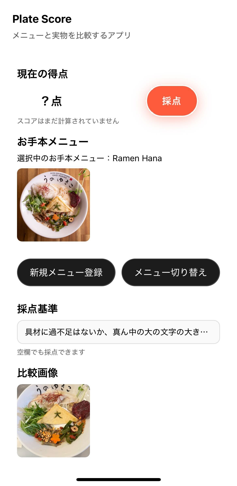
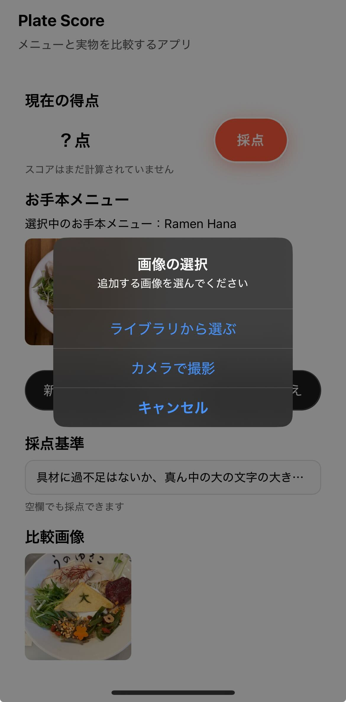
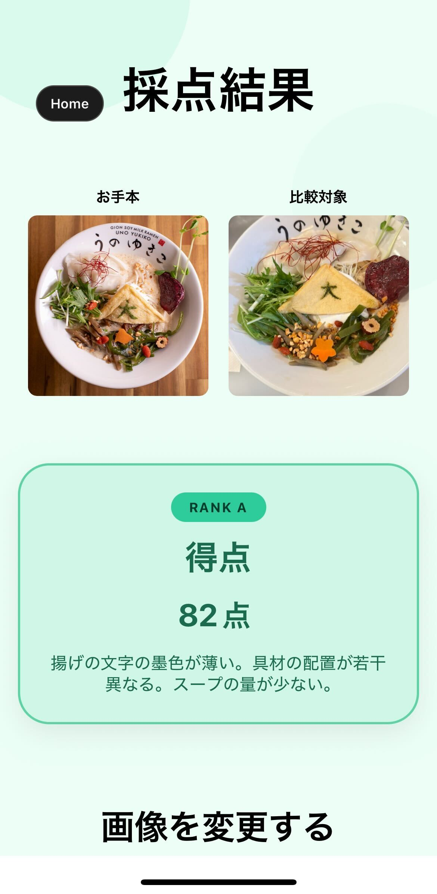

# PlateScore — AI 飲食店従業員教育アプリ


> **クローズドテスト協力者募集中です。**
> Google Play ストアの審査を通過しており、クローズドテスト完了次第リリース予定です。
> Android をお持ちの方はぜひご連絡ください。
> 連絡先: omotoharuumi@gmail.com

## 概要

飲食店の盛り付けばらつき問題を解決するため、スタッフがお手本画像と実際の料理を比較撮影し、AI が 100 点満点でスコアリングする Android アプリです。現在 Google Play クローズドテストを実施中です。

---

## スクリーンショット

| ホーム画面 | メニュー選択 | 透かし撮影 | 採点結果 |
|:-:|:-:|:-:|:-:|
|  |  |  |  |

---

## 開発中の動画
https://github.com/user-attachments/assets/eec4ad46-f3ba-46ee-8dc0-898412521213


## 主な工夫点

### 1. お手本透かし撮影機能

カメラのライブビュー上にお手本メニュー画像を半透明で重ねた状態で撮影できます。
スライダーで透明度（20〜85%）をリアルタイムに調整できるため、盛り付けの位置・量・形をその場で直感的に比較しながら撮影できます。

```
[カメラビュー] ← リアルタイムで重なる
[お手本画像]   ← 透明度スライダーで調整
```

> 実装: [`src/screens/CaptureScreen.tsx`](src/screens/CaptureScreen.tsx)

---

### 2. ゲーミフィケーションによるモチベーション設計

採点結果をゲームのランク（S / A / B / C / D）として表示し、スコアに応じた配色テーマと視覚エフェクトで演出します。採点ボタンはスコアが準備できると脈動アニメーションで通知し、「使いたくなる」体験を設計しています。

| ランク | 点数 | テーマカラー |
|--------|------|-------------|
| S | 90〜100 | ゴールド |
| A | 75〜89  | グリーン |
| B | 60〜74  | ブルー   |
| C | 40〜59  | オレンジ |
| D | ～39    | レッド   |

> 実装: [`src/screens/ResultScreen.tsx`](src/screens/ResultScreen.tsx)

---

### 3. メニューごとのカスタム採点基準

各メニューに採点基準（例：「スープは器の 8 割まで」「薬味は中央に」）を自由記述で設定でき、その基準を AI のプロンプトに組み込んで採点します。店舗ごと・メニューごとに最適化した評価が可能です。

> 実装: [`src/features/menu/`](src/features/menu/)

---

### 4. スマートなカメラフレームトリミング

カメラのアスペクト比と実際の写真のアスペクト比の差異を計算し、画面に表示されている範囲のみを正確に切り出します。縦横両方向の撮影に対応しています。

> 実装: [`src/screens/CaptureScreen.tsx`](src/screens/CaptureScreen.tsx)

---

### 5. AI プロンプト設計

採点 AI（マルチモーダル LLM）へのプロンプトを以下の点で工夫しています。

- **2 枚同時入力による比較評価**: お手本画像と撮影画像を同時に送信し、「お手本と比べてどれだけ再現できているか」という差分ベースの評価を実現しています。
- **ユーザー定義ルールの動的注入**: ユーザーがメニューごとに設定した採点基準（例：「盛り付けは皿の中央に」）をプロンプトに埋め込み、汎用的な盛り付け評価だけでなく、店舗・メニュー固有のルールで採点できます。
- **構造化出力の強制**: スコア（数値）とコメント（文字列）を確実に JSON 形式で返すようプロンプトを構成し、パース失敗を防いでいます。
- **採点軸の明示**: 採点基準が未設定の場合も、色・形・量・配置などの一般的な盛り付け評価軸を指示することで、一貫したスコアリングを担保しています。

> 実装: [`functions/src/index.ts`](functions/src/index.ts)

---

### 6. ローカルファーストのメニュー管理

メニューの登録・編集・削除を `AsyncStorage` でオフライン永続化しています。ネットワーク接続なしでメニュー管理が完結し、採点時のみ API を呼び出すため通信コストを最小化しています。

> 実装: [`src/features/menu/hooks/useMenuManager.ts`](src/features/menu/hooks/useMenuManager.ts)

---

## 技術スタック

| カテゴリ | 技術 |
|----------|------|
| 言語 | TypeScript 5.9 |
| フレームワーク | Expo 54 / React Native 0.81 |
| カメラ | expo-camera, expo-image-picker |
| 画像処理 | expo-image-manipulator, expo-file-system |
| ストレージ | @react-native-async-storage/async-storage |
| バックエンド | Google Cloud Run (Node.js) |
| AI | マルチモーダル LLM（Base64 画像送信） |

---

## アーキテクチャ

```
PlateScore/
├── App.tsx                          # 画面遷移ステートマシン
└── src/
    ├── screens/                     # 画面（Home / Capture / Result）
    ├── features/
    │   ├── menu/                    # メニュー管理（CRUD + AsyncStorage）
    │   └── evaluation/              # AI採点パイプライン
    │       ├── services/            # API クライアント
    │       └── hooks/               # 採点・比較フロー管理
    └── ui/                          # 共通 UI コンポーネント
```

採点パイプライン:
```
撮影画像 (URI)
  → Base64 変換
  → Cloud Run API (テンプレート画像 + 採点基準 + 撮影画像)
  → AI スコア & コメント (0〜100点)
  → ランク表示
```

---

## 背景・課題

飲食店経営者へのヒアリングで「従業員の熟練度や混雑時によって盛り付けにばらつきが出る」という課題を伺いました。既存の研修は口頭説明や紙のマニュアルが中心で、客観的な評価が困難でした。

PlateScore は **AI による即時フィードバック** と **ゲーミフィケーション** を組み合わせ、継続的な自己改善サイクルを構築します。

---

## Getting Started（ローカル開発）

```bash
git clone https://github.com/<your-username>/PlateScore.git
cd PlateScore
npm install
npx expo start
```

Android 実機または Expo Go アプリで確認できます。

---

## ライセンス

MIT
